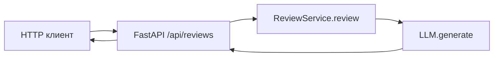

# ADR: решение для первого рабочего сценария

- Статус: proposed
- Дата: 2026-09-09
- Ответственные: команда практики

## Контекст

Нужно предоставить HTTP‑эндпоинт для авто‑ревью diff PR с использованием LLM. По `TRAINING_PR.diff` реализованы:
- FastAPI маршрут `POST /api/reviews` (app/api.py, 35–38).
- Сервис `ReviewService.review(diff: str)`, формирующий промпт и вызывающий `llm.generate` (app/review_service.py, 19–22).
Риски: отсутствие валидации/обработки исключений, неограниченный diff и prompt injection.

## Решение

Принять минималистичную архитектуру: HTTP API → сервис формирования промпта → абстракция LLM. Добавить инженерные практики:
1) Валидация входного JSON (`diff: str`).
2) Маппинг исключений LLM в контролируемые HTTP‑коды.
3) Ограничение размера и нормализация diff при включении в промпт.

## Рассмотренные альтернативы

| Альтернатива | Почему не выбрали сейчас |
|---|---|
| Синхронный прямой вызов LLM из контроллера | Усложняет тестирование и обработку ошибок; разделение обязанностей понятнее через сервис |
| Немедленное введение очередей/асинхронной обработки | Нет подтверждённых требований по SLA/нагрузке в diff |

## Последствия и главный риск

- Положительные последствия:
  - Простая схема и быстрый time‑to‑market; изоляция LLM в сервисе.
- Ограничения:
  - Требуются дополнительные соглашения по лимитам diff и ошибкам.
- Главный риск:
  - Prompt injection и рост 5xx при сбоях LLM.
- Как проверим риск:
  - Интеграционные/Е2Е тесты с инъекцией и симуляцией исключений; метрики доли 5xx.

## Архитектурная схема

## Как использовали AI

- Для чего: зафиксировать архитектурное решение по данным diff.
- Тип промпта: concise ADR.
- Строка в [`prompts.md`](prompts.md): P1-02.
- Что проверили и исправили сами: проверили ссылки на строки diff и ограничили вывод фактами из diff.
