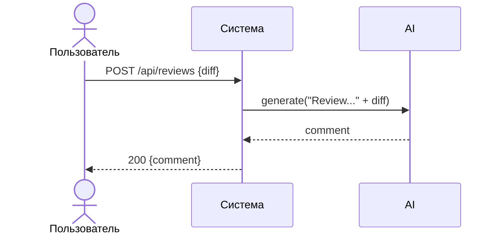

# Use cases и user stories

## Первый рабочий сценарий

**Когда** внешний клиент (CI/разработчик) отправляет POST `/api/reviews` с JSON `{"diff": "<unified diff>"}`, **система** формирует промпт из diff и вызывает LLM, **а пользователь получает** JSON `{"comment": "<текст ревью>"}`.

Не входит в этот сценарий:

- Аутентификация/авторизация, выбор поставщика LLM, модерация контента.

## Use case

| Поле | Значение |
|---|---|
| Актор | Внешний HTTP‑клиент (CI или разработчик) |
| Триггер | Отправка POST `/api/reviews` с телом JSON, содержащим ключ `diff` |
| Предусловия | Приложение запущено; доступен `/health` = ok |
| Основной результат | Возврат `{"comment": str}` — ответ LLM на сформированный промпт |
| Ошибка или отказ | При отсутствии `diff` сейчас возникает 500 из‑за `KeyError` (AS IS) [TRAINING_PR.diff: app/api.py, 35–38] |



## User stories и acceptance criteria

```gherkin
Feature: Авто‑ревью diff PR через API

  Scenario: Позитивный
    Given запущен сервис, доступен эндпоинт /api/reviews
    When клиент отправляет корректный JSON с ключом "diff" и строковым значением
    Then сервис возвращает 200 и JSON с ключом "comment"

  Scenario: Негативный или граничный
    Given запущен сервис
    When клиент отправляет JSON без ключа "diff" или с нестроковым типом
    Then (AS IS) сервис отвечает 500 из‑за KeyError; (TO BE) сервис отвечает 422/400 с описанием ошибки
```

## Как использовали AI

- Для чего: сверстать use case и user stories по фактам diff.
- Тип промпта: structured.
- Строка в [`prompts.md`](prompts.md): P1-01.
- Что проверили и исправили сами: добавили ссылки на строки diff и оставили негативный исход как AS IS.
