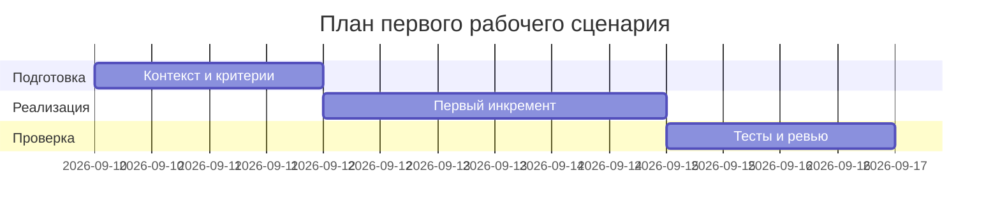

# План поставки

## Инкременты и ответственность

| Инкремент | Наблюдаемый результат | Что делает человек | Что делает AI или субагент | Проверка | Зависимости |
|---|---|---|---|---|---|
| 1 | Валидация входа для `/api/reviews` | Описывает схему тела `diff: str` | Генерирует шаблон Pydantic‑модели и примеры валидации | Негативный запрос без `diff` → 422/400 | TRAINING_PR.diff (api: 35–38) |
| 2 | Обработка исключений LLM | Определяет политику маппинга ошибок | Предлагает try/except каркас и тест‑кейсы | Симуляция исключения → контролируемый HTTP‑код | review_service (19–22), api (35–38) |
| 3 | Лимит и нормализация diff | Определяет лимит и стратегию усечения | Генерирует вспомогательные проверки длины | Тело > лимита → предсказуемый отказ/усечение | review_service (19–22) |

## Диаграмма Ганта

Замените даты и задачи на свой план.

## Как использовали AI

- Для чего: декомпозировать минимальные изменения для закрытия рисков из diff.
- Тип промпта: checklist.
- Строка в [`prompts.md`](prompts.md): P1-01.
- Что проверили и исправили сами: синхронизировали проверки с тест‑артефактами и ссылками на строки diff.
