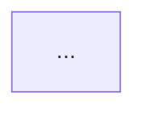

# Улучшение через фреймворк RCTF

## 1. Сконструированный RCTF-промпт

Role
- Principal Software Engineer (AI-assisted Code Review)

Context
- Вход: @practices/practice_01/TRAINING_PR.diff — изменения в FastAPI-приложении и сервисе LLM.
- Технический стек: Python, FastAPI; добавлен эндпоинт `POST /api/reviews`, сервис `ReviewService.review(diff: str)` вызывает `llm.generate`.
- Ограничения: работаем только по фактам diff; не придумываем правила и внешние требования. Если нет evidence в diff — риск не включаем.
- НФТ: приоритизируем надёжность (корректная классификация ошибок), безопасность (минимизация выхода секретов/инъекций), управляемость (воспроизводимые проверки).

Task
1. Прочитать TRAINING_PR.diff и кратко суммировать внесённые изменения.
2. Выявить до 3 технических риска, каждый подтвердить ссылками на файл и диапазон строк diff.
3. Для каждого риска сформулировать воспроизводимую проверку (AS IS → наблюдаемое поведение; TO BE → ожидаемое поведение).
4. Сформировать артефакт из трёх частей: краткий обзор, таблица рисков (candidate/evidence/check) и блок-схема Mermaid (AS IS vs TO BE поток ошибок).
5. Не выходить за пределы diff; пометки TO BE давать как предложения, без утверждений о реализованном коде.

Format
- Раздел 1: «Краткий обзор изменения» — 3–5 предложений.
- Раздел 2: «Риски и проверки» — Markdown-таблица с колонками: Candidate | Evidence (file:lines) | Check (AS IS → TO BE).
- Раздел 3: «Диаграмма потока» — блок-схема Mermaid, показывающая: запрос → валидация → подготовка промпта → LLM → ответ/ошибки (AS IS/TO BE ветки).

Полный RCTF-запрос
```
Role: Principal Software Engineer (AI-assisted Code Review)

Context:
- Input: @practices/practice_01/TRAINING_PR.diff (FastAPI endpoint POST /api/reviews; ReviewService.review(diff) -> llm.generate)
- Constraints: only facts from diff; no invented rules; max 3 risks.
- NFRs: reliability (proper error classification), safety (minimize injection/secret leakage), operability (reproducible checks).

Task:
1) Summarize the change in 3–5 sentences.
2) List up to 3 risks. For each:
   - Provide candidate (1 sentence)
   - Evidence with exact file:line-range from the diff
   - Reproducible check describing AS IS vs TO BE behavior
3) Provide a Mermaid flowchart of the request processing with AS IS and TO BE error paths.
4) Keep within the diff facts; TO BE is proposed, not implemented.

Format:
### Краткий обзор изменения
<text>

### Риски и проверки
| Candidate | Evidence (file:lines) | Check (AS IS → TO BE) |
|---|---|---|
| ... | ... | ... |

### Диаграмма потока

```

## 2. Новый артефакт

Новый артефакт сохранён в practices/practice_02/rctf/prompts.md. Краткое содержание указано ниже; см. полный артефакт по ссылке.

### Краткий обзор изменения
В diff добавлен эндпоинт FastAPI `POST /api/reviews`, принимающий `payload: dict` и передающий `payload["diff"]` в сервис. В `ReviewService` реализован метод `review(diff: str)`, который формирует промпт (вставляя diff целиком) и вызывает `llm.generate`, возвращая `{ "comment": answer }`. Обработка ошибок и валидация входа отсутствуют в изменениях.

### Риски и проверки (выдержка)
| Candidate | Evidence (file:lines) | Check (AS IS → TO BE) |
|---|---|---|
| Нет валидации тела запроса для POST /api/reviews | app/api.py:35–38 — доступ к `payload["diff"]` без проверки | POST `{}` → (AS IS) 500 из‑за KeyError; (TO BE) 422/400 с описанием ошибки |
| Нет обработки исключений при вызове LLM | app/review_service.py:19–22 — `self.llm.generate(prompt)` без try/except | Смоделировать исключение в LLM → (AS IS) 5xx без маппинга; (TO BE) 502/503 с контролируемым сообщением |
| Неконтролируемый размер diff и возможность prompt injection | app/review_service.py:19–22 — diff целиком встраивается в промпт | Очень длинный/вредоносный diff → (TO BE) отказ по лимиту/усечение; инъекция не влияет на системные инструкции |

### Диаграмма потока (выдержка)
```mermaid
flowchart LR
    A[POST /api/reviews] --> B{Валидация тела?}
    B -- AS IS: нет --> C[Подготовка промпта с полным diff]
    C --> D[self.llm.generate]
    D -- AS IS: исключение --> E[5xx без маппинга]
    D -- ok --> F[{"comment": answer}]
    B -- TO BE: ошибка --> X[422/400]
    D -- TO BE: исключение --> Y[502/503 контролируемо]
```

Полный артефакт: см. файл practices/practice_02/rctf/prompts.md

## 3. Анализ устранения недостатков

- Ясная роль: вместо расплывчатого «AI-reviewer и создатель документации» задана инженерная роль Principal Software Engineer с узким фокусом на ревью diff.
- Контекст: явно зафиксированы стек, вход, ограничения и НФТ, чего не хватало в исходном промпте.
- Чёткая задача: пошаговая последовательность исключает двусмысленности и «role creep» (нет требований «заполнять все файлы»).
- Формат: стандартизированная структура (обзор, таблица рисков, Mermaid) обеспечивает воспроизводимость и лёгкость peer review.
- Верифицируемость: каждый риск содержит проверку AS IS → TO BE, что связывает артефакт с тестовыми артефактами и метриками.
